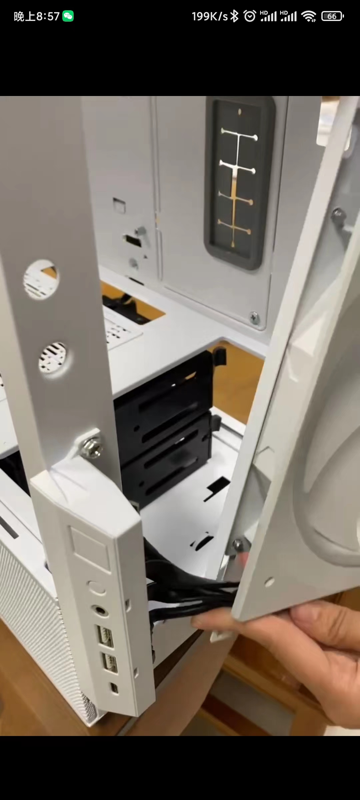
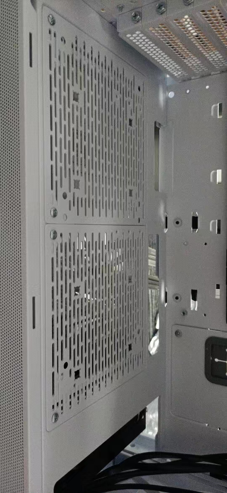

# 联力L216装机心得

2022年12月份装机笔记

## 参考视频 

B站硬件茶谈装机：https://www.bilibili.com/video/BV1BG4y137mG/?spm_id_from=333.337.search-card.all.click&vd_source=8f7bdd23b317e50e9b9803f44de6a213

联力L216机箱介绍:https://www.bilibili.com/video/BV15v4y12752/?spm_id_from=333.999.0.0&vd_source=8f7bdd23b317e50e9b9803f44de6a213

ARGB调光 白色海景房参考：https://www.bilibili.com/video/BV1QU4y1N7ha/?spm_id_from=333.999.0.0&vd_source=8f7bdd23b317e50e9b9803f44de6a213

风扇转速调节：安装完之后，风扇默认全速运行，噪音很大。需要进入BIOS里面调节参考视频

https://www.bilibili.com/video/BV1pv4y1M7zQ/?spm_id_from=333.999.0.0

## 1、配置

## 2、联力L216机箱信息

### 2.1 风扇

 预装: 前面板2个16CM风扇 + 一个后置风扇14CM（无光）

如果要装海景房，可以把后置14CM无光风扇拆下来，换成ARGB风扇。

机箱后面自带一个SATA供电集线器，最多可以连4个ARGB风扇（前面板两个风扇会占用两个）。如果要装海景房，可以买一个ARGB集线器。我买的是 利民ARGBHUB  二合一。

集线器相关安装可以参考:https://item.jd.com/10045117831791.html 商品详情页 视频和图文信息

风扇转速调节：安装完之后，风扇默认全速运行。需要进入BIOS里面调节参考下面

https://www.bilibili.com/video/BV1pv4y1M7zQ/?spm_id_from=333.999.0.0

### 2.2 IO面板：

机箱前I/O面板可以移动到侧边。如果习惯把机箱放电脑桌上，可以移到电脑桌右手边（前面板从上面移到机箱下面的左边）。

前置I/O面板不好直接安装，需要把前面的防尘网和前置16CM风扇拆下来，然后把IO面板的线从风扇中间卡进去。

具体可以参考：如果看图看不明白 问京东 先马供应商客服(他会给你发个视频 一看就懂)。

## 3、CPU相关

### 3.1 CPU选择

CPU选的13600K 可以给PR加速 如果只打游戏可以选择KF不带集显的CPU。

K代表可以超频 F代表不带集成显卡。

### 3.2 CPU、水冷、风扇安装

CPU可以看B站硬件茶谈的装机视频。

水冷我是用的先马镜系列KW360DW水冷。这个水冷式买先马电源送的，没花钱。

水冷：可以考虑 利民冰封幻境或者AE 360水冷。效果更好。固定水冷要用长螺丝。下面有图

风扇：我买了7个雅浚BF12PRO纯白积木风扇 4正转 3反转。 积木风扇线少，方便自己走线。

推荐从淘宝 泡泡不鸽家买，售后贼好。我是因为他家疫情原因没法发货，所以从闲鱼买了。价格不便宜，还不包邮。

风扇区分正反面: 有品牌图标面是正面。

反向风扇: 给机箱底部用，有品牌图标面对机箱内侧，没品牌图标面对着机箱下面电源仓。只能固定两个风扇，最后一个没螺丝孔没法固定。

普通正向风扇：三个给水冷用，一个给机箱内部后面出风口。有品牌图标面对机箱内侧，没品牌图标面对着机箱外侧吹风。

效果如图：

机箱地部风扇，需要拆除2个白色的硬盘架。固定风扇螺丝要用长螺丝，不能用拆下来硬盘架的短螺丝。见下图。

长螺丝：

### 3.3 固定水冷扣具

需要用到两头都有螺丝的支柱和黑色扣具（不同CPU用的扣具不一样 参考参考视频或者问水冷客服）。

我是13600K，需要用LGA1700黑色扣具。

注意:水冷泵 接主板 pump_fan 接口，另一个接主板ARGB接口（我的主板是 JRAINBOW接口）。这两个线不能接集线器，接集线器会导致水泵头灯光无法同步。

## 4、主板

机箱支持多型号的主板，不同型号的主板需要调节机箱固定主板螺丝柱。我是微星B660M迫击炮主板（M-ATX主板），螺丝柱调整信息参考下图圈红的地方。

注意：主板不能直接和机箱紧贴一起，必须要螺丝柱，否则会烧主板。

### 4.1 主板螺栓调节和固定

调整机箱主板螺丝柱需要用到 主板支座螺栓。

### 4.2 内存和固态硬盘

内存条插：24通道。

插入两条固态硬盘存在接口冲突的情况。

这款主板的接口冲突是当在 M2_2 接口中安装 M.2 SATA 固态硬盘时，SATA8 将无效。

## 5、机械硬盘

机械硬盘尽量选垂直盘，别买叠瓦盘（容易坏）。我选的是：海康威视西数代工监控硬盘4T。HIKVISIONWD40PURX

硬盘安装：带标签的那一面朝上，要不容易出问题。

## 6、电源

这个没啥多说的，看硬件茶谈的视频就行了。可以定淘宝的显卡电源直连线（有风险烧了接口 老黄不赔）。原生的太丑了。

https://www.bilibili.com/video/BV1RG411N7Uq/?spm_id_from=333.788&vd_source=8f7bdd23b317e50e9b9803f44de6a213

## 7、线缆接驳

这个没啥多说的，看硬件茶谈的视频就行了。

https://www.bilibili.com/video/BV1he411P7Mm/?spm_id_from=333.788&vd_source=8f7bdd23b317e50e9b9803f44de6a213

只有一个地方需要说：机箱里面没开关机跳线。只有一个fpanel线。接这个就行，一个fpanel顶多个（开机、重启、硬盘指示灯等）跳线。

## 8、风扇调节和ARGB灯效

ARGB调光 白色海景房参考：https://www.bilibili.com/video/BV1QU4y1N7ha/?spm_id_from=333.999.0.0&vd_source=8f7bdd23b317e50e9b9803f44de6a213

风扇转速调节：安装完之后，风扇默认全速运行，噪音很大。需要进入BIOS里面调节参考视频。

https://www.bilibili.com/video/BV1pv4y1M7zQ/?spm_id_from=333.999.0.0

微星主板下载MSI CENTER。

